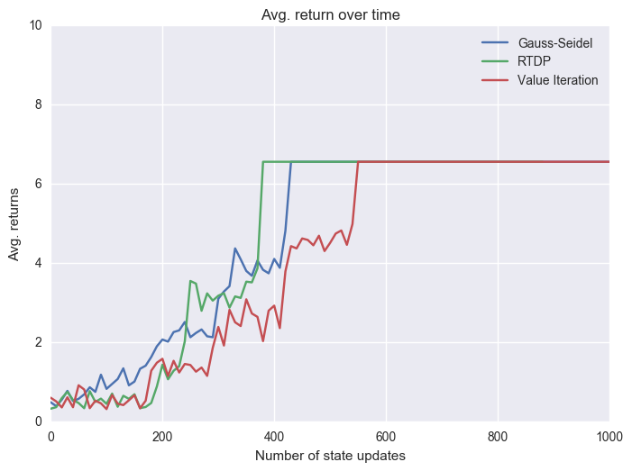

# Real-Time Dynamic Programming

This project explains, implements, and compares RTDP with Value Iteration and Gauss-Seidel DP.

The first commit contains code that was taken from the UC Berkeley AI Course, available at: http://ai.berkeley.edu/reinforcement.html

The Gridworld code was extended to create a larger grid with outer borders (outermost 2 rows/columns) having 1% probability to be entered from neighboring cells.

You can view the slides in the .pdf file, however, videos are not embedded, so make sure to take a look at the correspondingly named videos in the figs folder (val_iteration.mp4, gauss-seidel.mp4, rtdp.mp4).

To run the experiments, the following commands were issued:

python3 gridworld.py -a value -i 50 -n 0 -k 1 -g RandomGrid -w 50 -s 100

python3 gridworld.py -a valuegs -i 50 -n 0 -k 1 -g RandomGrid -w 50 -s 100

python3 gridworld.py -a rtdp -i 1 -n 0 -k 250 -g RandomGrid -w 50 -s 100

python3 graphs.py

